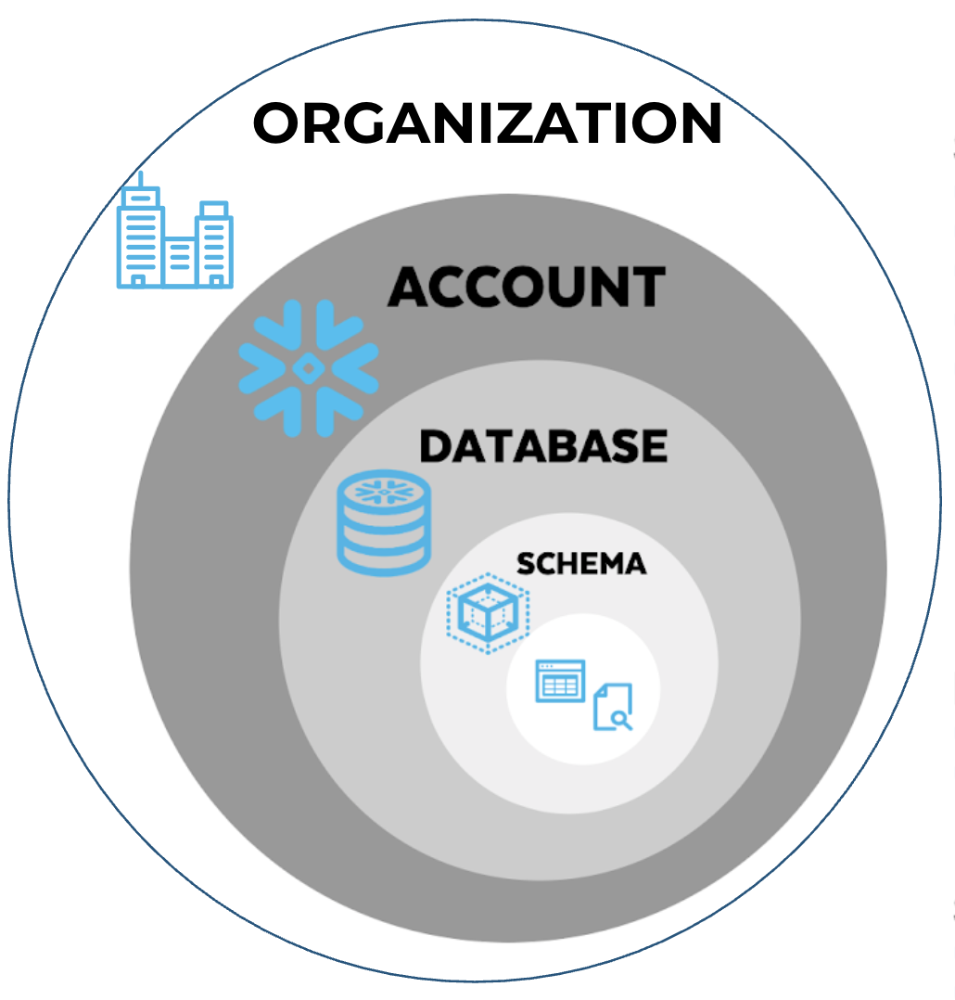

このステップでは、Snowflake プラットフォーム全体を形作る基盤的な決定を行います:

1. **アカウント戦略の選択** — シングルアカウントと 3 つのマルチアカウントパターン（ドメインベース、環境ベース、またはドメイン + 環境）のどれかを選択します

この決定は、このワークフローのすべての後続ステップがどのように動作するかを決定します。例えば:

* **シングルアカウント:** すべてのデータベース、ウェアハウス、データプロダクトが 1 つのアカウントに存在します
* **マルチアカウント:** ドメイン、環境、またはその両方で整理された追加のアカウントを（アカウント作成ワークフローで）作成します

ここでの回答（account_strategy）は、SQL 出力とガイダンスをカスタマイズするためにこのワークフロー全体で参照され、アカウント作成とデータプロダクトのワークフローに引き継がれます。

## **なぜこれが重要か？**

Snowflake のアカウント戦略を選択することは、ワークロードの整理方法、セキュリティ境界の管理方法、コストの配分方法を決定する重要な基盤的決定です。適切な戦略は、組織の規模、コンプライアンス要件、および運用モデルによって異なります。この決定は通常、**分離**（セキュリティとコンプライアンスのため）と**運用の簡略化**のバランスを取ることを含みます。このガイドは、シングルアカウントとマルチアカウントアプローチのどちらを選択するか、および組織機能を有効にするかどうかを決定するのに役立ちます。複雑さの増加順に並べられた 4 つの主要な戦略から選択するための意思決定基準を詳述します:

1. シングルアカウント
2. マルチアカウント（ドメインベース）
3. マルチアカウント（環境ベース）
4. マルチアカウント（ドメイン + 環境）

## **前提条件**

なし

## **主要な概念**

アカウント戦略を選択するには、Snowflake の**アカウント**とは何か、および Snowflake オブジェクトの階層を理解することが不可欠です:

**Snowflake オブジェクト階層**

[**Organization（組織）**](https://docs.snowflake.com/en/user-guide/organizations) - 組織は、ビジネスエンティティが所有するアカウントをリンクする Snowflake のファーストクラスオブジェクトです。このオブジェクトは、組織アカウントを作成するかどうかに関わらず存在します。[**組織アカウント**](https://docs.snowflake.com/en/user-guide/organization-accounts)（オプション）は、組織管理者が組織下のすべてのアカウントに影響するタスクを実行するために使用する特殊なタイプのアカウントです（例: 組織レベルのデータとクエリ履歴の表示、アカウント全体のユーザー管理など）。
* **[Snowflake アカウント](https://docs.snowflake.com/en/user-guide/organizations-connect)** - 顧客は組織内に 1 つ以上のアカウントを作成できます。各アカウントには、組織名とアカウント名で構成される独自の URL があります。各アカウントは、特定の [Snowflake エディション](https://docs.snowflake.com/en/user-guide/intro-editions)を持つ単一のクラウドプロバイダー（AWS、Azure、GCP）リージョンにデプロイされます。
  * **アカウントには[データベース](https://docs.snowflake.com/en/guides-overview-db)が含まれる** - 各データベースは単一の Snowflake アカウントに属し、データベースは他のアカウントにレプリケートできますが、複数のアカウントにまたがることはできません
    * **データベースには[スキーマ](https://docs.snowflake.com/en/sql-reference/commands-database#schema)が含まれる** - 各スキーマは単一の Snowflake データベースに属します
      * **スキーマにはオブジェクトが含まれる** - オブジェクトにはテーブル、ビュー、ファイルフォーマット、シーケンス、UDF、プロシージャなどが含まれます

## **考慮事項**

決定が必要な主な問題は、Snowflake のセットアップにシングルアカウントとマルチアカウントのどちらの戦略を採用するかです。戦略を確認する前に、以下の質問に答えることをお勧めします:

1. **データストレージ要件**: ソースシステムは**複数のクラウドプロバイダー**（AWS、Azure、GCP）または**複数のリージョン**に存在し、マルチクラウド/マルチリージョン組織が必要ですか？
2. **分離要件:** HIPAA、PCI、GDPR などの厳格なコンプライアンスルールにより、環境またはリージョンごとに本番データの物理的な分離が必要ですか？
3. **コスト管理:** 異なるビジネスユニットに対して正確な別々の請求書が必要ですか、または単一の請求書で問題ないですか？
4. **ガバナンスモデル:** ガバナンスは集中型（1 つのチームがすべてを管理）ですか、それとも分散型（自律的なビジネスユニットが自分自身のデータを管理）ですか？
5. **運用の複雑さ:** プラットフォームチームの規模はどれくらいですか？多くのアカウントのインフラを管理するためのスタッフ/成熟度がありますか？
6. **将来の成長:** 新しいリージョンへの拡張や他の会社の買収を計画していますか？
7. **ディザスタリカバリ（DR）/ ビジネス継続性**: マルチリージョンまたはマルチクラウドのフェイルオーバーが必要ですか？

## **ベストプラクティス**

### 常に組織アカウントを作成する

最初はシングルアカウントに傾いている場合でも、将来複数のアカウントを持つ可能性がある場合は、最初から[組織アカウント](https://docs.snowflake.com/en/user-guide/organization-accounts)を設定することが最善です。これにより、いくつかの主要な機能の集中化が可能になります。

### 一般的なマルチアカウント戦略

マルチアカウント戦略を実装したい顧客には、以下の 1 つまたは両方でアカウントを分離することをお勧めします:

**環境別**

**環境**はソフトウェア開発ライフサイクル（SDLC）のステージを表します。成熟度と安定性に基づいてデータ/アプリプロダクトの開発ステージを分離するために使用されます。

* **定義:** 開発、テスト、および本番ワークロードを分離するために使用される SDLC フェーズ
* **例:** SBX（サンドボックス）、DEV（開発）、TST（QA/テスト）、PRD（本番）
* **戦略における役割:** 環境は変更を分離して、非本番活動が本番の安定性に影響しないようにします。環境ベースのマルチアカウント戦略では、各ステージに別々のアカウントが作成されます（例: &lt;org&gt;_DEV、&lt;org&gt;_PROD）

**ドメイン別**

**ドメイン**はビジネス機能、データ、またはオーナーシップの論理的なグループを表します。通常、ガバナンス、コスト配分、データスチュワードシップの境界を定義するために使用されます。

* **定義:** ビジネスユニット/エンティティ、および/または部門
* **例:** サプライチェーン、小売、製造、および/または財務、マーケティング、HR
* **戦略における役割:** マルチアカウント戦略では、ドメインは別々の Snowflake アカウントの主要な境界の 1 つとして機能することが多いです（例: 自律性のための専用 HR アカウント、明確なチャージバックのための製造アカウント）

### **アカウント戦略のオプション**

注記: このガイドのオプションは、業界のベストプラクティスと一般的な顧客要件から統合された一般的な Snowflake アカウント戦略です。[Snowflake Standard または Enterprise エディション](https://docs.snowflake.com/en/user-guide/intro-editions)を使用している顧客を対象としています。これらのパターンに従うことが通常組織の成功につながると私たちは経験していますが、各組織はユニークです。このガイドを読んだ後に適切なソリューションを選択するために追加のサポートが必要と思われる場合は、次のステップに進む前にアカウントおよび/またはサービスチームに連絡してください。

非常に複雑、特殊、または厳格な規制要件がある場合は、追加のガイダンスを求めることも検討してください。[Snowflake Professional Services](https://www.snowflake.com/en/solutions/professional-services/)および/または[パートナー提供](https://www.snowflake.com/en/why-snowflake/partners/)をご確認ください！

|  | シングルアカウント | マルチアカウント（環境） | マルチアカウント（ドメイン） | マルチアカウント（ドメイン + 環境） |
| :---- | :---- | :---- | :---- | :---- |
| **要件** | 「PoC または小規模チームのために最小限のオーバーヘッドで素早く開始する必要がある。」 | 「本番データは開発者から物理的に分離されていなければならない。」 | 「マーケティングチームは自分のコンピュートの費用を支払い、独自の管理者を管理する。」 | 「厳格な規制コンプライアンスと自律的なビジネスユニットの両方が必要である。」 |
| **最適な対象** | PoC または小規模組織 | コンプライアンスソフトウェア開発 | 自律的なビジネスユニット | より大きなエンタープライズ |
| **主なデータ分離** | 論理的（データベース/スキーマ） | 物理的（アカウント） | 物理的（アカウント） | 物理的（アカウント） |
| **コスト追跡** | タグ付けが必要 | ドメインごとの別々の請求書 | ドメインごとの別々の請求書 | 精密な粒度 |
| **データ共有** | ゼロコピークローン | データ共有 | セキュアデータ共有 | 複雑な共有 |
| **複雑さ** | 低 | 中 | 中 | 高 |

### **どの戦略が自分の組織に適しているか？**

**1. シングルアカウント戦略**
**最適な対象:** 小規模組織、集中型データチーム、PoC（概念実証）。

**この戦略の仕組みは？**

このモデルでは、すべてのデータ環境（Dev、Test、Prod）とビジネスドメインが 1 つの Snowflake アカウント内に存在します。

**長所と短所**

* **長所:**
  * **簡略化された運用:** 統合されたエンタープライズビューを提供し、管理オーバーヘッドが最も低く、モニタリングのための単一のガラス越しのビューを提供します。
  * **データアクセシビリティ:** クロスデータベースクエリとジョインが最も簡単で、環境間でゼロコピークローンが利用可能です（例: 本番から開発へのクローン）。
  * **集中型ガバナンス:** セキュリティとポリシーが 1 か所で管理されます。
* **短所:**
  * **リスク:** 分離が低く、非本番環境での変更が理論的に本番リソース制限に影響する可能性があります。
  * **セキュリティ境界:** すべてのデータに対して単一のセキュリティ境界。

**これはあなたに適していますか？**

✅ **この戦略を選ぶ場合:**

* すべてのデータアセットとセキュリティを管理する**集中型データチーム**がある場合。
* モニタリングのための「単一のガラス越しのビュー」で**最もシンプルな管理**を求める場合。
* 本番データから即座に Dev 環境を作成する「ゼロコピークローン」機能など、**開発者の俊敏性**を優先する場合。
* 別々の請求書ではなくリソースのタグ付けで処理できる**シンプルなコスト配分**ニーズがある場合。

❌ **この戦略を避ける場合:**

* 本番データの**物理的な分離**を義務付ける厳格なコンプライアンス要件がある場合。
* 独自のセキュリティとリリーススケジュールに対して**完全な自律性**を必要とする別々のビジネスユニットがある場合。

---

**2. マルチアカウント（環境ベース）**
**最適な対象:** ソフトウェア開発ライフサイクル（SDLC）ステージ（Dev、Test、Prod など）間の強力な分離が必要な組織。

**この戦略の仕組みは？**

この戦略は環境を別々の Snowflake アカウントに分離します。一般的なパターンは、本番用の 1 つのアカウントと、各非本番環境（Dev と Test）の別々のアカウントです。

**長所と短所**

* **長所:**
  * **最大 SDLC 分離:** 本番と非本番ワークロード間の最強の分離。非本番が本番パフォーマンスに影響するリスクを低減します。
  * **独立したセキュリティ:** セキュリティコントロールとアクセスポリシーを各環境で異なるものにできます。
  * **コスト最適化:** コストを最適化するために環境ごとに異なる Snowflake エディションを使用できます。
  * **コンプライアンス:** 厳格な規制環境で必要とされることが多いです。
* **短所:**
  * **データの摩擦:** アカウント間でデータベースを「クローン」することはできません。本番から開発へのデータ移動はデータ共有またはレプリケーションが必要で、複雑さが増します。
  * **運用オーバーヘッド:** 複数のアカウントにわたるセキュリティとユーザーの管理が必要です。

**これはあなたに適していますか？**

✅ **この戦略を選ぶ場合:**

* **環境分離が重要な場合:** 非本番ワークロード（Dev/Test）が本番パフォーマンスまたはセキュリティ制限に影響しないことを確保する必要がある場合。
* **セキュリティポリシーが環境によって異なる場合:** 例えば、本番には厳格な IP 許可リストが必要だが、開発にはより緩いアクセスが必要な場合。
* **コンプライアンスが要因の場合:** 監査または規制要件が本番環境の明確な境界を指定している場合。
* **異なる Snowflake エディション**（例: Dev には Standard、本番には Business Critical）を有効にしてコストを最適化したい場合。

❌ **この戦略を避ける場合:**

* チームがテスト用に本番データの**即時クローン**に大きく依存している場合。アカウント間のデータ移動にはレプリケーションまたはデータ共有が必要で、摩擦が生じます。

---

**3. マルチアカウント（ドメインベース）**
**最適な対象:** 独立して運営する自律的なビジネスユニット（ドメイン）を持つ大企業。

**この戦略の仕組みは？**

このフェデレーションモデルでは、別々のビジネスユニット（例: 財務、マーケティング、HR）に独自のアカウントが与えられます。これは、ドメインが分散型の ACCOUNTADMIN レベルのオーナーシップを持つ**データメッシュ**アーキテクチャと一致します。

**長所と短所**

* **長所:**
  * **コスト配分:** 正確なチャージバック。各ビジネスユニットがどれだけ支出しているかを正確に把握できます。
  * **自律性:** ドメインは自分のデータ、リリーススケジュール、メンテナンスウィンドウを独立して管理できます。
  * **スケーラビリティ:** ドメインごとにコンピュートリソースを独立してスケールできます。
* **短所:**
  * **複雑さ:** ガバナンスと標準化の複雑さが高まります。
  * **サイロ:** データサイロを防ぎ、クロスドメイン分析を可能にするための堅牢なデータ共有フレームワークが必要です。

**これはあなたに適していますか？**

✅ **この戦略を選ぶ場合:**

* **分散型オーナーシップが目標の場合:** ビジネスユニット（例: 財務、マーケティング）が独自の管理者を持つ独立したエンティティとして運営する**データメッシュ**アーキテクチャに従っている場合。
* **チャージバックが優先事項の場合:** 複雑なタグ付けロジックなしで各ビジネスユニットに対して明確で別々の請求が必要な場合。
* **データ主権/居住:** ドメインが異なる地理的リージョンで運営されている場合（例: EU データは EU アカウントに留まる必要がある）。
* 異なるドメインに**異なるリリースケイデンス**またはメンテナンスウィンドウがある場合。

❌ **この戦略を避ける場合:**

* ビジネスユニットが頻繁に**ドメイン間でデータを結合**する必要がある場合。クロスアカウントデータ共有は機能しますが、シンプルなクロスデータベースジョインよりも多くのセットアップが必要です。

---

**4. マルチアカウント（ドメイン + 環境）**
**最適な対象:** ドメインと環境の両方に対して最大の分離と正確な制御が必要な大規模組織。

**この戦略の仕組みは？**

これは最も複雑で細かい戦略です。各ビジネスユニットには環境ごとに別々のアカウントがあります（例: Finance_Prod、Finance_Dev、Marketing_Prod）。

**長所と短所**

* **長所:**
  * **完全な分離:** 明確なオーナーシップ境界を持つ最強のセキュリティとコンプライアンスの態勢。
  * **細かなチャージバック:** チームとライフサイクルステージによるコストの最も正確な追跡。
* **短所:**
  * **高いオーバーヘッド:** 最高の運用複雑さ。大量のアカウントを管理するための自動化が必要です。
  * **データ移動:** ドメインと環境間でデータを移動するための広範なデータ共有とレプリケーション設定が必要です。

**これはあなたに適していますか？**

✅ **この戦略を選ぶ場合:**

* 他の戦略では満たすことができない複雑なガバナンスニーズを持つ**大企業**の場合。
* **最高レベルの分離**が必要な場合: 「マーケティング Dev」での侵害または問題が「財務 Prod」に影響することが技術的に不可能でなければならない場合。
* 数十または数百のアカウントの管理を自動化できる**成熟したプラットフォームチーム**がある場合。

❌ **この戦略を避ける場合:**

* 強固な**自動化（Infrastructure as Code）**がない場合。これほど多くのアカウントを手動で管理することは運用上実行不可能です。

## **追加情報**

* [Organizations](https://docs.snowflake.com/en/user-guide/organizations) — Snowflake 組織の概要
* [Organization Accounts](https://docs.snowflake.com/en/user-guide/organization-accounts) — 組織アカウントで複数のアカウントを管理する
* [Snowflake Editions](https://docs.snowflake.com/en/user-guide/intro-editions) — エディション間の機能比較
* [Account Identifiers](https://docs.snowflake.com/en/user-guide/admin-account-identifier) — アカウントの命名と URL の理解
* [Data Sharing](https://docs.snowflake.com/en/user-guide/data-sharing-intro) — アカウント間でデータを共有する
* [Database Replication](https://docs.snowflake.com/en/user-guide/database-replication-intro) — アカウント間でデータをレプリケートする

### 設定の質問

#### どのアカウント戦略を実装したいですか？（`account_strategy`: multi-select）
組織に最も適したアカウント戦略を選択します。選択によって、ドメイン（ビジネスユニット/エンティティ）と環境の整理方法が決まります:
  **シングルアカウント:**
  * 最適な対象: 小〜中規模組織、集中型チーム、シンプルなガバナンス
  * 命名: データベースレベルでのドメイン + 環境 + データプロダクト
  * 長所: 運用オーバーヘッドが低い、クロスデータベースクエリが容易、集中管理
  * 短所: 分離が少ない、共有リソース制限、単一セキュリティ境界
  * 推奨: 将来の成長を可能にするために、シングルアカウントのデプロイでも組織アカウントの設定を検討する
* **マルチアカウント（環境ベース）:**
  * 最適な対象: 強力な環境分離（dev/test/prod）が必要な組織
  * 命名: アカウントレベルでの環境、データベースレベルでのドメイン + データプロダクト
  * 長所: 完全な環境分離、独立したセキュリティコントロール、別々の請求
  * 短所: より複雑なデータ共有、高い運用オーバーヘッド
  * 要件: 組織アカウントが必要
* **マルチアカウント（ドメインベース）:**
  * 最適な対象: 自律的なビジネスユニット/ドメインを持つ大企業
  * 命名: アカウントレベルでのドメイン、データベースレベルでの環境 + データプロダクト
  * 長所: ドメインごとの明確なコスト配分、独立したガバナンス、ドメインの自律性
  * 短所: 高い複雑さ、クロスドメイン分析にはデータ共有が必要
  * 要件: 組織アカウントが必要
* **マルチアカウント（ドメイン + 環境）:**
  * 最適な対象: ドメインと環境の両方の分離が必要な大規模組織
  * 命名: アカウントレベルでのドメイン + 環境、データベースレベルでのデータプロダクト
  * 長所: 最大の分離、明確なオーナーシップと環境分離
  * 短所: 最高の複雑さと運用オーバーヘッド、最も多くのアカウントを管理
  * 要件: 組織アカウントが必要
* **追加情報:**
  * [Organizations](https://docs.snowflake.com/en/user-guide/organizations)
  * [Managing Multiple Accounts](https://docs.snowflake.com/en/user-guide/organizations-manage-accounts)
**オプション:**
- Single Account
- Multi-Account (Environment-based)
- Multi-Account (Domain-based)
- Multi-Account (Domain + Environment)
